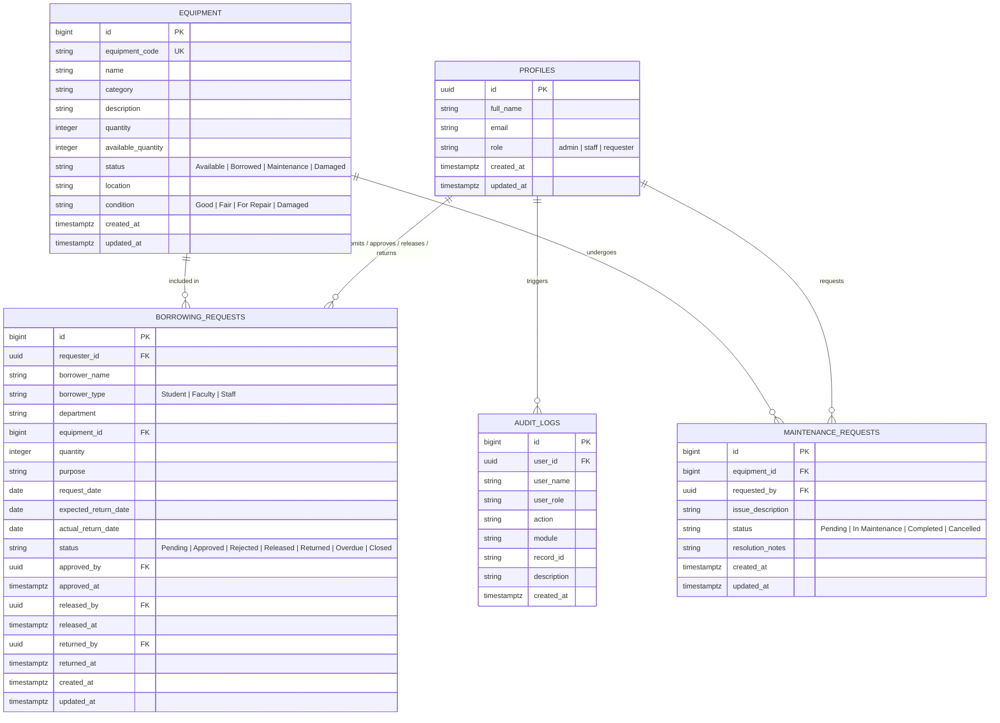
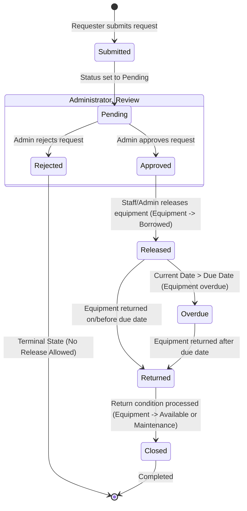

# Laboratory Asset and Service Management System
## Systems Analysis & Design (SAD) Documentation

---

### A. UPDATED ENTITY-RELATIONSHIP DIAGRAM (ERD)



---

### B. USE CASE DIAGRAM

```mermaid
graph TD
    subgraph Laboratory Asset & Service Management System
        UC1[Login / Authentication]
        UC2[View Available Equipment]
        UC3[Submit Borrowing Request]
        UC4[View Own Request Status & History]
        UC5[Approve Borrowing Request]
        UC6[Reject Borrowing Request]
        UC7[Release Equipment]
        UC8[Process Return]
        UC9[Submit Maintenance Request]
        UC10[Manage Maintenance]
        UC11[Manage Equipment CRUD]
        UC12[Manage Users & Roles]
        UC13[View Audit Logs]
        UC14[View Dashboard Reports]
    end

    Requester((Requester / Viewer))
    Staff((Laboratory Staff))
    Admin((Administrator))

    Requester --> UC1
    Requester --> UC2
    Requester --> UC3
    Requester --> UC4

    Staff --> UC1
    Staff --> UC2
    Staff --> UC3
    Staff --> UC7
    Staff --> UC8
    Staff --> UC9
    Staff --> UC10
    Staff --> UC11
    Staff --> UC14

    Admin --> UC1
    Admin --> UC2
    Admin --> UC3
    Admin --> UC5
    Admin --> UC6
    Admin --> UC7
    Admin --> UC8
    Admin --> UC9
    Admin --> UC10
    Admin --> UC11
    Admin --> UC12
    Admin --> UC13
    Admin --> UC14
```



---

### C. ROLE-PERMISSION MATRIX

| Function / Module | Administrator | Laboratory Staff | Requester / Viewer |
|---|:---:|:---:|:---:|
| View Available Equipment | ✅ Allowed | ✅ Allowed | ✅ Allowed |
| Submit Borrowing Request | ✅ Allowed | ✅ Allowed | ✅ Allowed |
| View Own Borrowing History | ✅ Allowed | ✅ Allowed | ✅ Allowed |
| Approve Borrowing Request | ✅ Allowed | ❌ Blocked | ❌ Blocked |
| Reject Borrowing Request | ✅ Allowed | ❌ Blocked | ❌ Blocked |
| Release Approved Equipment | ✅ Allowed | ✅ Allowed | ❌ Blocked |
| Process Equipment Return | ✅ Allowed | ✅ Allowed | ❌ Blocked |
| Submit Maintenance Request | ✅ Allowed | ✅ Allowed | ❌ Blocked |
| Manage Maintenance Status | ✅ Allowed | ✅ Allowed | ❌ Blocked |
| Add / Edit Equipment | ✅ Allowed | ✅ Allowed | ❌ Blocked |
| Delete Equipment Record | ✅ Allowed | ❌ Blocked | ❌ Blocked |
| User & Role Management | ✅ Allowed | ❌ Blocked | ❌ Blocked |
| View Audit Logs | ✅ Allowed | ❌ Blocked | ❌ Blocked |
| View System Reports | ✅ Allowed | ✅ Allowed | ❌ Blocked |

---

### D. BORROWING WORKFLOW DIAGRAM



---

### E. BUSINESS RULES SUMMARY (BR-A4-01 to BR-A4-10)

* **BR-A4-01**: Only available equipment may be requested (`status = 'Available'` and `available_quantity > 0`). Borrowed, Maintenance, or Damaged equipment requests are blocked.
* **BR-A4-02**: Staff cannot approve their own request (`requester_id != current_user_id`).
* **BR-A4-03**: Only Administrator may approve or reject requests.
* **BR-A4-04**: Only Approved requests may be released. Pending or Rejected requests cannot be released.
* **BR-A4-05**: Released equipment becomes Borrowed. Request status becomes `Released`, equipment `available_quantity` decreases, and status becomes `Borrowed` when quantity is exhausted.
* **BR-A4-06**: Returned equipment becomes Available unless damaged. If returned condition is `Good`/`Fair`, status becomes `Available`. If `Damaged`, status becomes `Maintenance` or `Damaged`.
* **BR-A4-07**: Rejected requests cannot be released. Operation is blocked at UI and database RLS levels.
* **BR-A4-08**: Returned transactions cannot be processed twice. Attempts to re-return `Returned` or `Closed` transactions are blocked.
* **BR-A4-09**: Equipment under Maintenance cannot be borrowed. Request submission is blocked with an explicit error message.
* **BR-A4-10**: Sensitive operations must be logged to `audit_logs` (`APPROVED`, `REJECTED`, `RELEASED`, `RETURNED`, `DELETED`, `CREATED`, `UPDATED`, `LOGIN`, `LOGOUT`, `MAINTENANCE_REQUESTED`, `MAINTENANCE_UPDATED`).

---

### F. FUNCTIONAL TEST RESULTS TABLE

| Test ID | Scenario | Expected Result | Actual Result | Status |
|---|---|---|---|:---:|
| **TC-A4-01** | Viewer/Requester attempts to open Admin page (`/admin` or `#usersSection`) | Access denied alert displayed & user redirected to Requester Dashboard | Access Denied alert displayed; navigation blocked by UI & Supabase RLS | **PASSED** |
| **TC-A4-02** | Staff submits borrowing request | Request saved with status `Pending` | Request saved as Pending; visible in Admin review queue | **PASSED** |
| **TC-A4-03** | Administrator approves request | Status becomes `Approved` and audit log is created | Status updated to Approved; audit log record created with Action `APPROVED` | **PASSED** |
| **TC-A4-04** | Administrator rejects request | Status becomes `Rejected` | Status updated to Rejected; audit log record created | **PASSED** |
| **TC-A4-05** | Attempt to release rejected request | Operation blocked with warning message | Action button disabled; function blocks release with message "Rejected release: Rejected requests cannot be released." | **PASSED** |
| **TC-A4-06** | Release approved equipment | Request status = `Released`, Equipment status = `Borrowed` | Request status set to Released; Equipment available quantity updated | **PASSED** |
| **TC-A4-07** | Return released equipment | Request status = `Returned`, Equipment status = `Available` | Request status set to Returned; Equipment restored to Available condition | **PASSED** |
| **TC-A4-08** | Check audit log after approval | Approval entry visible in Audit Log | Entry logged with Date, User, Action `APPROVED`, Module `Borrowing` | **PASSED** |
| **TC-A4-09** | Staff attempts restricted delete | Delete operation blocked | Delete button hidden for Staff; API call blocked by RLS & authorization check | **PASSED** |
| **TC-A4-10** | Logout and open protected page | Redirected to `login.html` | Session cleared; unauthenticated user automatically redirected to login | **PASSED** |

---

### G. GITHUB PAGES DEPLOYMENT STEPS

1. **Initialize Git Repository**:
   ```bash
   git init
   git add .
   git commit -m "Complete Laboratory Asset and Service Management System v2.0"
   ```

2. **Add Remote GitHub Repository**:
   ```bash
   git remote add origin https://github.com/<your-username>/<your-repo-name>.git
   git branch -M main
   git push -u origin main
   ```

3. **Configure GitHub Pages**:
   - Go to your repository settings on GitHub: **Settings > Pages**.
   - Under **Build and deployment**, set **Source** to `Deploy from a branch`.
   - Select `main` branch and `/ (root)` folder, then click **Save**.
   - Your site will be published live at `https://<your-username>.github.io/<your-repo-name>/`.
